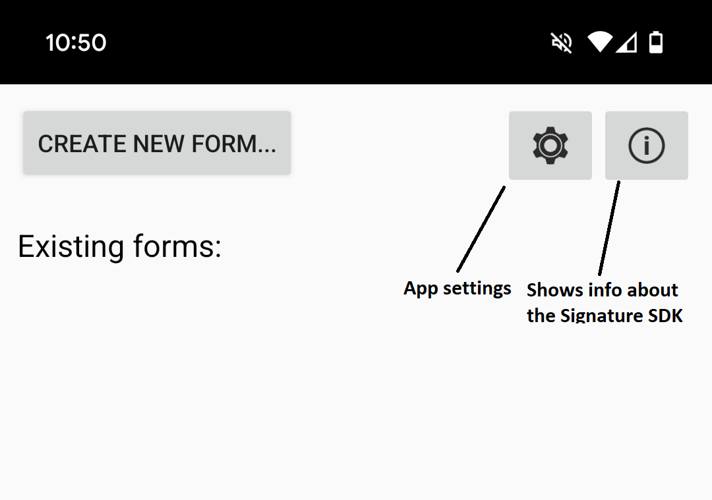
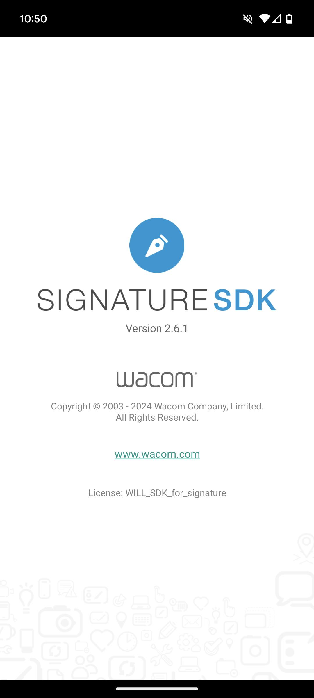
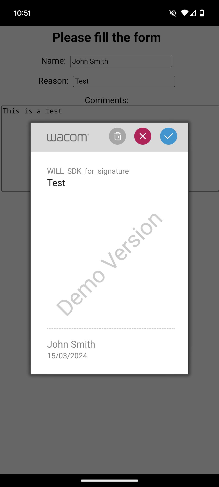
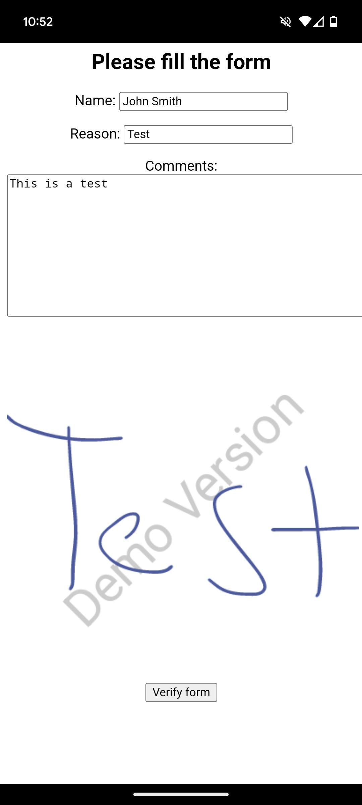

# Getting Started 

## Development environment

The *Wacom Ink SDK for Signature* for Android is supplied for use on Android Devices with a built-in stylus. Specifically, it has been tested on:

* Samsung Galaxy Note series (mobiles and tablets)
* Wacom Cintiq Hybrid

## Download the Wacom Ink SDK for signature

Download the SDK from https://developer.wacom.com/developer-dashboard

* Login using your Wacom ID
* Navigate to **Downloads for signature**
* Select **More info** on **Wacom Ink SDK for Signature for Android**
* Accept the End User License Agreement and select **Download** to use the SDK

The downloaded Zip file contains the SDK with documentation.

## Download an evaluation license

A license is needed to use the Wacom Ink SDK for signature and a fully functional evaluation license is free to download as follows:

* Navigate to https://developer.wacom.com/developer-dashboard
* log in using your Wacom ID
* Select **Licenses**
* Select **New Evaluation License**
* Select **Generate Evaluation License** for Wacom Ink SDK for Signature
* Return to Licenses where the new license file is ready for download
* Download the license file

The license is supplied as a JWT text string in a text file.
This will need to be copied into your application.
The self-service evaluation licenses have a three-month expiry date from the time of creation.
However, you can generate a new license at any time.

## Add the Wacom Ink SDK for signature to an existing project

The SDK is distributed as an *aar* library for Android Studio.
In order to set up the SignatureSDKExample app in your development environment, perform the following steps:

* Open the SignatureSDKExample with Android Studio IDE
* From the Android Studio menu, navigate to: 
  `File -> New -> New Module -> Import .JAR/.AAR Package`
*	Under Root Directory, click Browse and locate the SDK .aar file.
* Click on Finish to complete the library import.

Now to reference the newly created module with the SDK in the SignatureSDKExample project:

* Right-click on the SignatureSDKExample project to open the contextual menu.
* Click on `Open Module Settings`
* On the `Dependencies` tab, add a new module dependency selecting the SDK library module.

To apply the license:
* Place the supplied license file under the Assets folder of the SignatureSDKExample project.
* Open the file FormViewerActivity.java under package com.wacom.signaturesdkexample in src.
* Locate the line: 
        `public static final String LICENSE = "Put the licence string here";`
  and replace the string with the license string.

The SignatureSDKExample app can now be built and tested on any compatible Android device.

## Using the Sample Application

From the download Zip file, take the files `signaturesdk_2.4.aar` and `will-sdk-1.8.4.aar` and add them to SignatureSDKExample/app/libs/. 

* Running the SignatureSDKExample on Android Studio, you will see the main screen

* About screen shows information about the SDK version

* From the settings screen, it is possible to change the size, color, width, encryption method and signature format (for more information see SDK documentation)

* To create a new form you can fill in the fields `Name`, `Reason` and `Comments`. The form data will be attached to the signature when signing the form

### Signature capture

* Click on the **Sign form** button to capture a signature. This will launch the Signature Capture window as shown below:

* Using the pen, sign on the screen. Click on the ‘OK’ button (tick symbol). Note that buttons to ‘Clear’ or ‘Cancel’ the signature are included.

### Import signature

* It is possible to attach to the form an existing signature instead of capturing a new one. However, in this case, the form data won't be attached to the signature.

### Verify signature

* Click on the **Verify form** button to verify that the form has not been changed.

### Form options

### Export signature

### Delete signature

### Signature details

----

