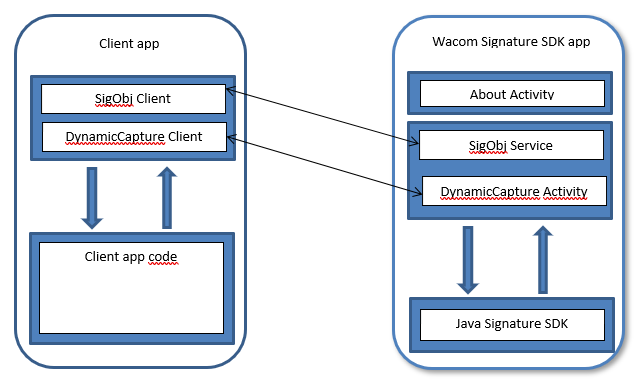

# Wacom Ink SDK for signature - Android

## Introduction

---

The *Wacom Ink SDK for Signature for Android* contains a set of Activities and Services which provide the functionality for capturing and displaying signatures from compatible Android devices.

The *Wacom Ink SDK for Signature for Android* consists of the following parts:

* About Activity: This window consists of a simple dialog box with the version, licensing and contact information.

* SigObj Service: This class wraps the java SDK SigObj methods and properties, and makes it visible as an Android service available for public access from other applications.

* DynamicCapture Activity: Opens a window for capturing the signature and returns the signature data as a byte array.

    
## GitHub Samples

Samples are included to help get started with the SDK.

---

# Additional resources 

## Sample Code
For further samples check Wacom's Developer additional samples, see [https://github.com/Wacom-Developer](https://github.com/Wacom-Developer)

## Documentation
For further details on using the SDK see [Wacom Ink SDK for signature documentation](http://developer-docs.wacom.com/sdk-for-signature/) 

The API Reference is available directly in the downloaded SDK.

## Support
If you experience issues with the technology components, please see the related [FAQs](https://developer-support.wacom.com/hc/en-us)

For further support file a ticket in our **Developer Support Portal** described here: [Request Support](https://developer-support.wacom.com/hc/en-us/requests/new)

## Developer Community 
Join our developer community:

- [LinkedIn - Wacom for Developers](https://www.linkedin.com/company/wacom-for-developers/)
- [Twitter - Wacom for Developers](https://twitter.com/Wacomdevelopers)

## License 
This sample code is licensed under the [MIT License](https://choosealicense.com/licenses/mit/)

---
